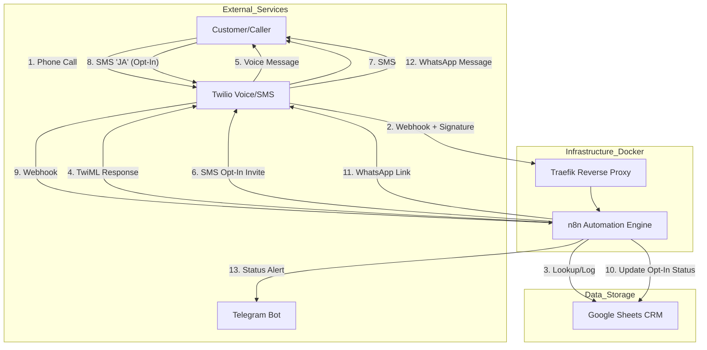

# Vorzimmerdrache: System Architecture Documentation

## 1. Overview
Vorzimmerdrache is an automated communication bridge designed for craftsmen ("Roof-Mode"). It intercepts incoming calls via Twilio, provides automated voice responses, manages SMS-to-WhatsApp conversion (Double Opt-In), and logs all interactions in a Google Sheets-based CRM. The system ensures that craftsmen can remain focused on site while leads are captured and qualified via automated messaging.

## 2. System Architecture Diagram
The following flowchart illustrates the end-to-end data flow from initial contact to CRM update.

## 3. Workflow Descriptions

### 3.1 Workflow: Roof-Mode (Incoming Call)
*   **Trigger:** Twilio Voice Webhook (`POST /webhook/incoming-call`).
*   **Validation:** HMAC-SHA1 signature verification using `TWILIO_AUTH_TOKEN` to prevent spoofing.
*   **Normalization:** JavaScript-based phone number formatting (converts `017x`, `0049`, `49` to E.164 format `+49...`).
*   **Logic:**
    1.  **Immediate Response:** Returns TwiML `<Say>` and `<Pause>` to the caller ("Moin! Wir sind auf dem Dach...").
    2.  **CRM Lookup:** Queries Google Sheets for the normalized phone number.
    3.  **SMS Dispatch:** Sends an SMS with a WhatsApp Opt-In request ("Antworten Sie mit JA").
    4.  **Logging:** Appends call timestamp and caller ID to the `Call_Log` sheet.
    5.  **Alerting:** Sends a Telegram notification to the craftsman.

### 3.2 Workflow: SMS Opt-In
*   **Trigger:** Twilio SMS Webhook (`POST /webhook/sms-response`).
*   **Logic:**
    1.  **Parsing:** Evaluates the message body. If "JA" (case-insensitive):
    2.  **CRM Update:** Updates the "Opt-In" column in Google Sheets for the corresponding phone number.
    3.  **WhatsApp Handover:** Sends an automated WhatsApp message via Twilio (or WAHA) containing the appointment/booking link.
    4.  **Alerting:** Notifies the craftsman via Telegram that a lead has opted in.

## 4. Onboarding & CRM Structure
### 4.1 CRM Data Model (Google Sheets)
The system requires a Spreadsheet with at least two sheets:
1.  **Customers:** `[Phone, Name, Company, OptIn_Status, Last_Contact]`
2.  **Call_Log:** `[Timestamp, Phone, Status, Action_Taken]`

### 4.2 Onboarding Procedure
1.  **Manual Entry:** Admin adds known customers to the "Customers" sheet.
2.  **Automated Entry:** New callers are automatically appended to the `Call_Log`. If the "Lookup" fails in the Roof-Mode workflow, the system treats them as "New Leads" and follows the fallback SMS path.

## 5. Interfaces
### 5.1 Craftsman (Handwerker) Interface
*   **Passive:** Receives real-time Telegram alerts for missed calls and successful WhatsApp opt-ins.
*   **Active:** Communicates with customers via WhatsApp once the automated flow provides the link.

### 5.2 Administrator Interface
*   **Monitoring:** n8n execution dashboard to track workflow successes/failures.
*   **Data Management:** Google Sheets UI for editing customer details and reviewing call history.
*   **Configuration:** `.env` file for API keys, phone numbers, and Telegram Chat IDs.

## 6. Error Handling & Monitoring
*   **Node-Level Retries:** Twilio nodes configured with 3 retries and 2s wait intervals.
*   **Error Branches:** All critical nodes (Sheets, Twilio, HTTP) have error paths connected to Telegram alerts.
*   **Infrastructure:** 
    *   Docker health checks monitor n8n availability.
    *   Traefik provides rate limiting (100 avg/200 burst) to prevent Webhook DDoS.
    *   SQLite WAL (Write-Ahead Logging) mode enabled to prevent database locking during concurrent writes.

## 7. Security Measures
*   **Request Validation:** All Twilio webhooks are validated using the `X-Twilio-Signature` header.
*   **Transport Security:** Forced HTTPS via Traefik and Let's Encrypt TLS.
*   **Authentication:** n8n UI protected via Basic Auth and JWT.
*   **Environment Isolation:** Sensitive credentials stored in `.env` and injected into the container at runtime; no keys are hardcoded in n8n JSON.

## 8. Technical Stack Summary
| Component | Technology | Role |
| :--- | :--- | :--- |
| **Orchestration** | n8n (v1.50.0) | Workflow logic and integration |
| **Gateway** | Twilio | Voice, SMS, and WhatsApp API |
| **Proxy** | Traefik v2.11 | SSL termination and request routing |
| **Database** | SQLite (WAL mode) | n8n internal state management |
| **Storage** | Google Sheets API | CRM and logging |
| **Alerting** | Telegram Bot API | Real-time craftsman notifications |
| **Containerization**| Docker / Compose | Deployment and environment isolation |
