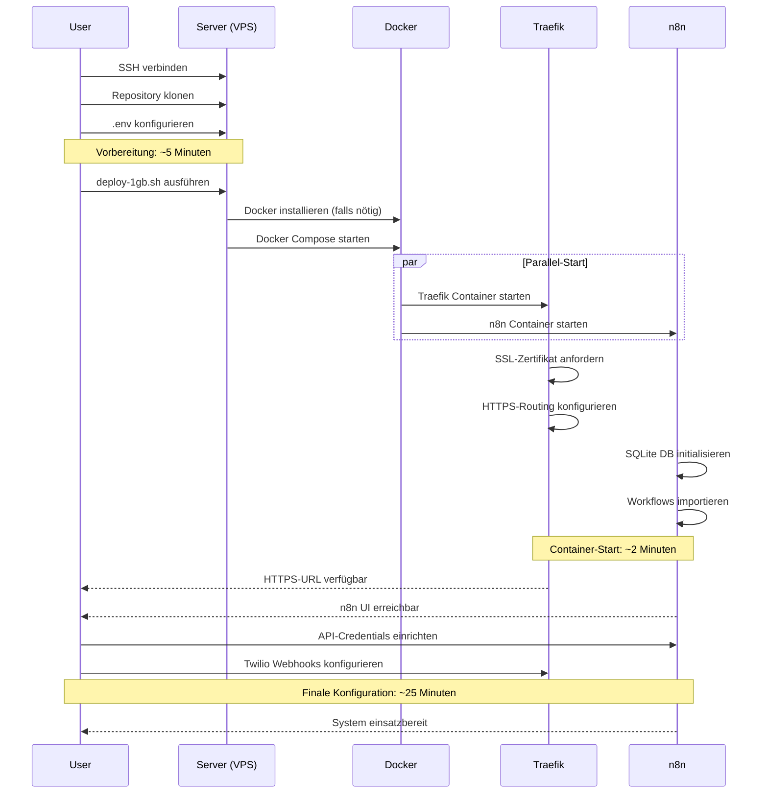

# Anleitung zur Server-Einrichtung

## Voraussetzungen

### Server-Anforderungen

#### Option A: Oracle Cloud (Empfohlen - Kostenlos)
- **Instanz**: ARM1 (Ampere A1) - 4 OCPUs, 24 GB RAM
- **Storage**: 200 GB Boot Volume (inklusive)
- **OS**: Ubuntu 22.04 LTS
- **Kosten**: Kostenlos (Always Free Tier)
- **Domain**: instance2.duckdns.org (aktiv)

#### Option B: Hetzner/Andere VPS
- **RAM**: Mindestens 1 GB (CX11 bei Hetzner empfohlen)
- **Storage**: Mindestens 20 GB (Docker-Volumes + Logs)
- **OS**: Ubuntu 22.04 LTS oder Debian 12
- **Ports**: 80 und 443 müssen offen sein
- **Docker**: 20.10+ (wird vom Deploy-Skript installiert, falls nicht vorhanden)

### Domain-Konfiguration
- Domain oder Subdomain, die auf Ihre Server-IP zeigt
- DNS A-Record erforderlich (AAAA für IPv6 optional)
- Empfohlen: DuckDNS für kostenloses dynamisches DNS
  - **Aktuell:** `instance2.duckdns.org` (Oracle Cloud)
  - **Alt:** `instance1.duckdns.org` (Hetzner - deaktiviert)

### Erforderliche Konten

**Twilio** (WhatsApp + Voice)
- Account SID und Auth Token
- WhatsApp-fähige Telefonnummer
- Genehmigte WhatsApp-Vorlage
- Mindestens 20 € Guthaben erforderlich

**Google** (Sheets API)
- Google Cloud-Projekt
- Sheets API aktiviert
- OAuth2-Anmeldeinformationen ODER Service Account
- Tabelle mit der Konto-E-Mail geteilt

**Telegram** (Alert notifications)
- Bot-Token von @BotFather
- Chat ID für Benachrichtigungen

---

## Schnelle Bereitstellung

### Deployment-Ablauf (Übersicht)



### 1. Repository klonen

### 1. Repository klonen
```bash
git clone <your-repo-url> vorzimmerdrache
cd vorzimmerdrache
```

### 2. Umgebungsvariablen konfigurieren
```bash
cp .env.example .env
nano .env
```

Aktualisieren Sie diese wichtigen Variablen:
- `DOMAIN`: Ihre Domain
- `SSL_EMAIL`: E-Mail für Let's Encrypt-Zertifikate
- `N8N_ENCRYPTION_KEY`: Generieren mit `openssl rand -hex 16`
- `TWILIO_ACCOUNT_SID`: Aus der Twilio-Konsole
- `TWILIO_AUTH_TOKEN`: Aus der Twilio-Konsole
- `TWILIO_PHONE_NUMBER`: Ihre Twilio-Nummer
- `TWILIO_WHATSAPP_SENDER`: WhatsApp-fähige Nummer
- `TELEGRAM_BOT_TOKEN`: Von @BotFather
- `TELEGRAM_CHAT_ID`: Ihre Telegram Chat ID
- Google-Anmeldeinformationen (siehe Abschnitt Service Accounts unten)

### 3. Deploy-Skript ausführen
```bash
chmod +x scripts/deploy-1gb.sh
./scripts/deploy-1gb.sh
```

**WICHTIG: Swap-Datei erstellen (empfohlen für 1GB VPS)**

Das Deploy-Skript erstellt automatisch eine 1GB Swap-Datei, um Out-of-Memory (OOM) Fehler zu verhindern. Manuell kannst du dies mit folgenden Befehlen tun:

```bash
# Swap-Datei erstellen (1GB)
sudo fallocate -l 1G /swapfile
sudo chmod 600 /swapfile
sudo mkswap /swapfile
sudo swapon /swapfile

# Swap permanent machen
echo '/swapfile none swap sw 0 0' | sudo tee -a /etc/fstab

# Swap-Nutzung optimieren
echo 'vm.swappiness=10' | sudo tee -a /etc/sysctl.conf
sudo sysctl -p

# Prüfen
free -h
```

### 4. Auf n8n zugreifen
```bash
# Das Skript gibt Ihre URL aus
https://your-domain.com/
```

Standard-n8n-Login (falls konfiguriert):
- Prüfen Sie die `.env` auf `N8N_BASIC_AUTH_USER` und `N8N_BASIC_AUTH_PASSWORD`

---

## Detaillierte Konfiguration

### Umgebungsvariablen

#### Erforderliche Variablen
```bash
# SSL und Domain
SSL_EMAIL=admin@example.com              # E-Mail für Let's Encrypt
DOMAIN=instance2.duckdns.org             # Ihre Domain
N8N_ENCRYPTION_KEY=...                   # Generieren: openssl rand -hex 16

# n8n Konfiguration
N8N_HOST=${DOMAIN}                       # Gleich wie DOMAIN
N8N_PORT=5678                            # Standard-n8n-Port
N8N_PROTOCOL=https                        # HTTPS mit Traefik
WEBHOOK_URL=https://${DOMAIN}/           # Basis-URL für Webhooks
NODE_ENV=production                      # Produktionsmodus
GENERIC_TIMEZONE=Europe/Berlin           # Ihre Zeitzone
```

#### Twilio-Konfiguration
```bash
TWILIO_ACCOUNT_SID=AC...                 # Aus der Twilio-Konsole
TWILIO_AUTH_TOKEN=...                    # Aus der Twilio-Konsole
TWILIO_PHONE_NUMBER=+491234567890        # Ihre Twilio-Nummer
TWILIO_WHATSAPP_SENDER=whatsapp:+49...   # WhatsApp-fähige Nummer
TWILIO_WHATSAPP_TEMPLATE_SID=WH...       # Template SID von Twilio
```

#### Telegram-Konfiguration
```bash
TELEGRAM_BOT_TOKEN=1234567890:ABC...     # Von @BotFather
TELEGRAM_CHAT_ID=123456789               # Ihre Chat ID (Nachricht an @userinfobot senden)
```

#### Google Sheets OAuth2
```bash
GOOGLE_SHEETS_SPREADSHEET_ID=1U73YUGk... # Aus der Tabellen-URL
GOOGLE_SHEETS_SHEET_NAME=Leads           # Blatt-/Tab-Name
GOOGLE_SHEETS_RANGE=Sheet1!A1:F100       # Datenbereich
GOOGLE_OAUTH_CLIENT_ID=...apps.googleusercontent.com
GOOGLE_OAUTH_CLIENT_SECRET=...
GOOGLE_OAUTH_REFRESH_TOKEN=...          # Langlebiger Token
GOOGLE_OAUTH_ACCESS_TOKEN=...           # Kurzfristig, automatisch aktualisiert
```

#### Google Sheets Service Account (Alternative)
```bash
GOOGLE_SHEETS_SPREADSHEET_ID=1U73YUGk... # Aus der Tabellen-URL
GOOGLE_SHEETS_SHEET_NAME=Leads           # Blatt-/Tab-Name
GOOGLE_SHEETS_RANGE=Sheet1!A1:F100       # Datenbereich
GOOGLE_SHEETS_SERVICE_ACCOUNT_JSON='{"type":"service_account",...}'
# Gesamten JSON-Schlüssel als einzeiligen String einfügen
```

#### SMS Opt-in (Optional)
```bash
SMS_OPT_IN_WEBHOOK_URL=https://.../webhook/sms-response
```

### Docker Compose-Architektur

#### Dienste

**Traefik** (Reverse Proxy)
- Image: `traefik:v2.11`
- Speicherlimit: 256MB
- Speicherreservierung: 64MB
- Ports: 80 (HTTP), 443 (HTTPS)
- Zweck: SSL-Terminierung, Routing, Lastverteilung

**n8n** (Workflow Automation)
- Image: `docker.n8n.io/n8nio/n8n`
- Speicherlimit: 512MB
- Speicherreservierung: 128MB
- Datenbank: SQLite (intern, keine externe DB)
- Zweck: Workflow-Ausführung, Webhook-Verarbeitung

#### Gesamter Ressourcenverbrauch
- **Gesamter Container-RAM**: ~300MB
- **OS-Overhead**: ~200MB
- **Freier RAM**: ~500MB für Spitzen

#### Health Checks
```yaml
Traefik: Integriert (Container-Neustart)
n8n: wget http://localhost:5678/ alle 30s
  - Timeout: 10s
  - Wiederholungen: 3
  - Startperiode: 60s
```

#### Volume-Verwaltung
```yaml
letsencrypt:  SSL-Zertifikate (Let's Encrypt)
n8n_data:     n8n SQLite-Datenbank + Workflows + Anmeldeinformationen
```

### Service Accounts

#### Google Sheets: OAuth2 vs. Service Account

**OAuth2 (Original Setup)**
- ✅ Einfach einzurichten
- ✅ Funktioniert mit geteilten/persönlichen Tabellen
- ❌ Tokens laufen ab (benötigt Refresh-Mechanismus)
- ❌ Nicht ideal für Headless-Server

**Service Account (Empfohlen)**
- ✅ Kein Token-Ablauf
- ✅ Besser für Headless-Server
- ✅ Sicherer (Anmeldeinformationen in JSON-Datei)
- ❌ Erfordert das Teilen der Tabelle mit der Service Account-E-Mail

#### Schritte zur Einrichtung des Service Accounts

**1. Google Sheets API aktivieren**
```bash
# Gehen Sie zu: https://console.cloud.google.com/apis/library
# Suchen Sie nach: "Google Sheets API"
# Klicken Sie auf "Aktivieren"
```

**2. Service Account erstellen**
```bash
# Gehen Sie zu: https://console.cloud.google.com/iam-admin/serviceaccounts
# Klicken Sie auf "Service Account erstellen"
# Name: "Vorzimmerdrache-n8n"
# Klicken Sie auf "Erstellen und fortfahren"
# Rollen überspringen (optional)
# Klicken Sie auf "Fertig"
```

**3. JSON-Schlüssel generieren**
```bash
# Klicken Sie auf Ihren neuen Service Account
# Gehen Sie zum Tab "Schlüssel"
# Klicken Sie auf "Schlüssel hinzufügen" → "Neuen Schlüssel erstellen"
# Schlüsseltyp: JSON
# Laden Sie die JSON-Datei herunter
# Inhalte in .env kopieren:
GOOGLE_SHEETS_SERVICE_ACCOUNT_JSON='{"type":"service_account",...}'
# Wichtig: Einfache Anführungszeichen verwenden, innere Anführungszeichen bei Bedarf escapen
```

**4. Die Tabelle teilen**
```bash
# Öffnen Sie Ihre Tabelle
# Klicken Sie auf "Teilen"
# Service Account-E-Mail hinzufügen (aus JSON-Datei, Feld "client_email")
# Als "Editor" festlegen
# Klicken Sie auf "Senden"
```

**5. n8n konfigurieren**
```bash
# Anmeldeinformationen zu .env hinzufügen (in Schritt 3 erledigt)
# Workflows/roof-mode.json importieren
# Google Sheets-Node mit Service Account-Anmeldeinformationen aktualisieren
# JSON aus GOOGLE_SHEETS_SERVICE_ACCOUNT_JSON verwenden
```

#### Twilio API-Einrichtung

**1. Konto-Anmeldeinformationen abrufen**
```bash
# Gehen Sie zu: https://console.twilio.com/
# Dashboard → Projektinformationen
# Account SID und Auth Token kopieren
```

**2. WhatsApp-Nummer abrufen**
```bash
# Messaging → Ausprobieren → Eine WhatsApp-Nachricht senden
# Eine Sandbox-Nummer erhalten ODER eine WhatsApp-fähige Nummer kaufen
# Nummer in .env als TWILIO_WHATSAPP_SENDER kopieren
# Format: whatsapp:+491234567890
```

**3. WhatsApp-Vorlage genehmigen**
```bash
# Messaging → Einstellungen → WhatsApp-Vorlagen
# Vorlage erstellen (muss vor der Verwendung genehmigt werden)
# Vorlagenname und SID → In .env kopieren
```

**4. Sprachnummer abrufen**
```bash
# Telefonnummern → Eine Nummer kaufen
# Nach deutscher Nummer suchen (+49)
# Auswählen und kaufen
# Nummer in .env als TWILIO_PHONE_NUMBER kopieren
# Format: +491234567890
```

#### Telegram Bot-Einrichtung

**1. Bot erstellen**
```bash
# Telegram öffnen
# Suchen Sie nach: @BotFather
# Senden Sie: /newbot
# Folgen Sie den Anweisungen, um Ihren Bot zu benennen
# Bot-Token in .env als TELEGRAM_BOT_TOKEN kopieren
```

**2. Chat ID abrufen**
```bash
# Telegram öffnen
# Suchen Sie nach: @userinfobot
# Chat starten
# Der Bot antwortet mit Ihrer Chat ID
# In .env als TELEGRAM_CHAT_ID kopieren
```

**3. Bot testen**
```bash
# Suchen Sie in Telegram nach Ihrem Bot anhand des Benutzernamens
# Senden Sie eine Nachricht, um die Funktion zu überprüfen
```

---

## Fehlerbehebung

### Häufige Probleme und Lösungen

#### Problem: n8n startet nicht
**Symptome**: Container startet ständig neu, Logs zeigen Fehler
**Lösungen**:
```bash
# Logs prüfen
docker compose logs n8n

# .env-Syntax überprüfen (keine Leerzeichen um =)
# Prüfen, ob N8N_ENCRYPTION_KEY genau 32 Zeichen lang ist

# Mit sauberem Zustand neu starten
docker compose down -v
docker compose up -d
```

#### Problem: Let's Encrypt-Zertifikat schlägt fehl
**Symptome**: Traefik zeigt 404, SSL-Zertifikatsfehler
**Lösungen**:
```bash
# Prüfen, ob DNS auf die richtige IP zeigt
dig +short your-domain.com

# Prüfen, ob Port 80 aus dem Internet erreichbar ist
# Von lokalem Rechner ausführen:
curl http://your-domain.com/

# Traefik-Logs prüfen
docker compose logs traefik

# Let's Encrypt-Cache leeren und erneut versuchen
rm -rf letsencrypt/acme.json
docker compose restart traefik
```

#### Problem: Twilio-Webhooks werden nicht ausgelöst
**Symptome**: n8n-Workflows werden bei Anrufen/Nachrichten nicht ausgeführt
**Lösungen**:
```bash
# Webhook-URL überprüfen
# Sollte sein: https://your-domain.com/webhook/twilio

# Prüfen, ob n8n zugänglich ist
curl https://your-domain.com/

# Prüfen, ob der n8n-Webhook-Node aktiv ist
# n8n UI öffnen → Workflow-Status prüfen

# Twilio-Webhook-Logs in der Twilio-Konsole prüfen
# Monitor → Debugger
```

#### Problem: Google Sheets API-Authentifizierung schlägt fehl
**Symptome**: Workflow schlägt am Google Sheets-Node fehl
**Lösungen**:
```bash
# Tabellen-ID überprüfen
# In Browser-URL prüfen: docs.google.com/spreadsheets/d/SPREADSHEET_ID

# Blattname und Bereich überprüfen
# Blattname muss exakt übereinstimmen (Groß-/Kleinschreibung beachten)

# OAuth2: Prüfen, ob Tokens nicht abgelaufen sind
# Neu generieren unter: https://developers.google.com/oauthplayground/

# Service Account: Prüfen, ob JSON gültig ist
# Testen mit: echo "$JSON" | python3 -m json.tool

# Prüfen, ob Tabelle mit der richtigen E-Mail geteilt ist
# OAuth2: OAuth-Client-E-Mail verwenden
# Service Account: "client_email" aus JSON verwenden
```

#### Problem: Telegram-Bot sendet keine Nachrichten
**Symptome**: Keine Telegram-Benachrichtigungen
**Lösungen**:
```bash
# Bot-Token überprüfen
# Nachricht an Bot in Telegram senden, um zu testen

# Chat ID überprüfen
# Mit @userinfobot prüfen

# API direkt testen:
curl -X POST "https://api.telegram.org/bot${TELEGRAM_BOT_TOKEN}/sendMessage" \
  -d "chat_id=${TELEGRAM_CHAT_ID}" \
  -d "text=Test message"
```

### Docker-Fehler

#### Container hat keinen Speicher mehr
**Symptome**: OOMKilled, Container starten neu
**Lösungen**:
```bash
# Speichernutzung prüfen
docker stats

# Speicherlimits in docker-compose.yml erhöhen
# Oder docker-compose-low-memory.yml verwenden

# n8n-Ausführungsdaten-Aufbewahrung reduzieren
# Setzen Sie: EXECUTIONS_DATA_MAX_AGE=72 (hours)
```

#### Container lässt sich nicht stoppen
**Lösungen**:
```bash
# Stoppen erzwingen
docker compose kill

# Container entfernen
docker compose rm -f

# System bereinigen
docker system prune -a
```

#### Probleme beim Volume-Mounting
**Symptome**: Zugriff verweigert, Volume-Fehler
**Lösungen**:
```bash
# Volume-Berechtigungen prüfen
ls -la ./letsencrypt
ls -la n8n_data

# Berechtigungen korrigieren
sudo chown -R 1000:1000 ./letsencrypt
sudo chown -R 1000:1000 ./n8n_data

# Oder Volumes neu erstellen
docker compose down -v
docker compose up -d
```

### n8n Startprobleme

#### n8n UI lädt nicht
**Lösungen**:
```bash
# Prüfen, ob n8n fehlerfrei ist
docker compose ps

# n8n-Logs prüfen
docker compose logs -f n8n

# Prüfen, ob Traefik korrekt routet
docker compose logs traefik

# n8n-Port-Mapping prüfen
docker port vorzimmerdrache-n8n-1
```

#### Workflows werden nicht ausgeführt
**Lösungen**:
```bash
# Prüfen, ob Workflow aktiv ist (grüner Schalter)
# Ausführungsverlauf in der n8n UI prüfen
# Webhook-URL überprüfen
# Prüfen, ob der Webhook-Node "Response Mode: On Last Node" hat
```

#### Datenbank-Sperrfehler
**Lösungen**:
```bash
# SQLite unterstützt gleichzeitige Schreibvorgänge nicht gut
# n8n neu starten, um Sperren freizugeben
docker compose restart n8n

# Für die Produktion den Wechsel zu PostgreSQL in Betracht ziehen
# Siehe docker-compose-low-memory.yml
```

### Traefik SSL-Zertifikatsprobleme

#### Zertifikat wird nicht erneuert
**Symptome**: Zertifikat abgelaufen, SSL-Warnungen
**Lösungen**:
```bash
# acme.json prüfen
cat letsencrypt/acme.json

# Prüfen, ob E-Mail in .env korrekt ist
grep SSL_EMAIL .env

# Erneuerung manuell durch Neustart von Traefik auslösen
docker compose restart traefik

# Löschen und erneut versuchen (letzter Ausweg)
rm -rf letsencrypt/acme.json
docker compose restart traefik
```

#### Rate Limiting von Let's Encrypt
**Symptome**: Zertifikatserstellung schlägt fehl
**Lösungen**:
```bash
# 1 Stunde warten (Rate Limit: 5 Zertifikate/Domain/Stunde)
# Staging-Umgebung zum Testen verwenden
# In docker-compose.yml auskommentieren:
# --certificatesresolvers.letsencrypt.acme.caserver=https://acme-staging-v02.api.letsencrypt.org/directory
```

### Speicherengpass auf 1GB VPS

#### System langsam, hohe Last
**Lösungen**:
```bash
# Speichernutzung prüfen
free -h

# Container-Speicher prüfen
docker stats

# Dienste neu starten, um Speicher freizugeben
docker compose restart

# Low-Memory Compose-Datei verwenden
docker compose -f docker-compose-low-memory.yml up -d

# n8n-Ausführungsbereinigung aktivieren
# Bereits in der Standardkonfiguration aktiviert:
# EXECUTIONS_DATA_PRUNE=true
# EXECUTIONS_DATA_MAX_AGE=168
```

#### OOM (Out of Memory) Killer
**Symptome**: Prozesse beendet, System instabil
**Lösungen**:
```bash
# Swap-Speicher hinzufügen (1GB empfohlen)
sudo fallocate -l 1G /swapfile
sudo chmod 600 /swapfile
sudo mkswap /swapfile
sudo swapon /swapfile
echo '/swapfile none swap sw 0 0' | sudo tee -a /etc/fstab

# n8n-Speicherlimit reduzieren
# docker-compose.yml bearbeiten:
# n8n memory: 512M → 384M

# Unnötige Dienste deaktivieren
# Beispiel: Wenn kein SMS-Opt-in verwendet wird, Webhook-Endpunkte entfernen
```

#### Docker verbraucht viel Speicher
**Lösungen**:
```bash
# Unbenutzte Images bereinigen
docker image prune -a

# Build-Cache bereinigen
docker builder prune

# Gestoppte Container entfernen
docker container prune

# Docker-Daemon-Speicher begrenzen
# /etc/docker/daemon.json bearbeiten:
{
  "log-driver": "json-file",
  "log-opts": {
    "max-size": "10m",
    "max-file": "3"
  }
}
sudo systemctl restart docker
```

**Log-Rotation konfigurieren (automatisch im Deploy-Skript):**

```bash
# Prüfen, ob daemon.json existiert
cat /etc/docker/daemon.json

# Falls nicht vorhanden, erstellen:
sudo mkdir -p /etc/docker
sudo tee /etc/docker/daemon.json > /dev/null <<EOF
{
  "log-driver": "json-file",
  "log-opts": {
    "max-size": "10m",
    "max-file": "3"
  }
}
EOF

# Docker neu starten
sudo systemctl restart docker

# Prüfen
docker info | grep -A 10 "Logging Driver"
```

---

## Überwachung

### Logs prüfen

#### Alle Dienste
```bash
# Alle Logs (letzte 100 Zeilen)
docker compose logs --tail=100

# Logs in Echtzeit verfolgen
docker compose logs -f

# Spezifischer Dienst
docker compose logs -f n8n
docker compose logs -f traefik
```

#### n8n-Logs
```bash
# Letzte 50 Zeilen
docker compose logs --tail=50 n8n

# Seit 1 Stunde
docker compose logs --since=1h n8n

# Nach Fehlern filtern
docker compose logs n8n | grep -i error
```

#### Traefik-Logs
```bash
# SSL-Zertifikatsprobleme prüfen
docker compose logs traefik | grep -i certificate

# Routing-Probleme prüfen
docker compose logs traefik | grep -i router
```

### Health Endpoints

#### n8n Health Check
```bash
# Lokaler Check
curl http://localhost:5678/healthz

# Externer Check
curl https://your-domain.com/healthz
```

#### Container-Status
```bash
# Alle Container mit Health-Status anzeigen
docker compose ps

# Detaillierte Informationen
docker inspect vorzimmerdrache-n8n-1 | grep -A 10 Health
```

### Ressourcenüberwachung

#### Systemressourcen
```bash
# CPU, Speicher, Festplatte
htop

# Speichernutzung
free -h

# Festplattennutzung
df -h

# Docker-Statistiken
docker stats
```

#### Container-spezifisch
```bash
# n8n-Speichernutzung
docker stats vorzimmerdrache-n8n-1 --no-stream

# Traefik-Speichernutzung
docker stats vorzimmerdrache-traefik-1 --no-stream

# Festplattennutzung der Volumes
du -sh ./letsencrypt ./n8n_data
```

#### Monitor-Skript (Erstellen Sie `scripts/monitor.sh`)
```bash
#!/bin/bash
echo "=== System-Speicher ==="
free -h

echo -e "\n=== Docker-Container ==="
docker compose ps

echo -e "\n=== Docker-Statistiken ==="
docker stats --no-stream

echo -e "\n=== Festplattennutzung ==="
df -h

echo -e "\n=== Aktuelle Logs (Fehler) ==="
docker compose logs --tail=20 | grep -i error || echo "Keine Fehler gefunden"
```

```bash
chmod +x scripts/monitor.sh
./scripts/monitor.sh
```

### Benachrichtigungen

#### Telegram-Benachrichtigungen (via n8n)
- Bereits in Workflows konfiguriert
- Benachrichtigungen gesendet für: neue Anrufe, Fehler, Systemprobleme
- n8n-Workflow prüfen: `workflows/roof-mode.json`

#### n8n Interne Überwachung
- n8n UI aufrufen → Einstellungen → Überwachung
- Workflow-Ausführungsverfolgung aktivieren
- E-Mail-Benachrichtigungen einrichten (optional)

#### Twilio-Guthaben-Monitoring (Empfohlen)

**Automatische Warnung bei niedrigem Guthaben:**

Erstelle einen n8n-Workflow, der stündlich das Twilio-Guthaben prüft:

```json
{
  "name": "Twilio Balance Monitor",
  "nodes": [
    {
      "type": "cron",
      "parameters": {
        "triggerTimes": {
          "item": [
            {
              "mode": "everyX",
              "value": 1,
              "unit": "hours"
            }
          ]
        }
      }
    },
    {
      "type": "httpRequest",
      "parameters": {
        "url": "https://api.twilio.com/2010-04-01/Accounts/{{ $env.TWILIO_ACCOUNT_SID }}/Balance.json",
        "authentication": "predefinedCredentialType",
        "nodeCredentialType": "twilioApi",
        "options": {}
      }
    },
    {
      "type": "if",
      "parameters": {
        "conditions": {
          "string": [
            {
              "value1": "={{ $json.balance.amount }}",
              "operation": "smaller",
              "value2": "5.00"
            }
          ]
        }
      }
    },
    {
      "type": "telegram",
      "parameters": {
        "chatId": "={{ $env.TELEGRAM_CHAT_ID }}",
        "text": "⚠️ Twilio-Guthaben niedrig: {{ $json.balance.amount }} {{ $json.balance.currency }}. Bitte aufladen!"
      }
    }
  ]
}
```

**Twilio Auto-Recharge einrichten:**
1. Twilio Console → Billing → Payment Methods
2. "Auto Recharge" aktivieren
3. Schwellenwert: €5.00
4. Aufladebetrag: €20.00

---

## Sicherheitshinweise

### Traefik API-Sicherheit

#### Dashboard-Exposition (Standard: Deaktiviert)
```yaml
# Traefik-Dashboard ist standardmäßig NICHT exponiert
# Zum Aktivieren (NICHT empfohlen in der Produktion):
# Zu docker-compose.yml Traefik-Befehl hinzufügen:
# --api.insecure=true
# --api.dashboard=true
```

#### Docker Socket-Sicherheit
```yaml
# Docker-Socket ist schreibgeschützt gemountet
# volumes:
#   - "/var/run/docker.sock:/var/run/docker.sock:ro"
# Verhindert, dass der Container die Docker-Konfiguration ändert
```

#### API Rate Limiting
```bash
# Traefik hat kein integriertes Rate Limiting
# n8n-Workflow verwenden, um die Webhook-Verarbeitung zu begrenzen
# Beispiel: Max. 100 Anrufe/Stunde pro Telefonnummer
```

### Webhook-Validierung

#### Twilio Signatur-Validierung
```bash
# n8n Twilio-Node validiert Signaturen automatisch
# Sicherstellen, dass TWILIO_AUTH_TOKEN korrekt gesetzt ist
# Prüfen, ob Webhook-URL mit Twilio-Konfiguration übereinstimmt
```

#### Benutzerdefinierte Webhook-Sicherheit
```bash
# Für benutzerdefinierte Webhooks API-Schlüssel-Validierung hinzufügen
# Im n8n-Workflow: "Set"-Node mit Prüfung hinzufügen:
# IF $webhook.headers["x-api-key"] !== $env.WEBHOOK_API_KEY
#   THEN Anfrage ablehnen
```

#### Nur HTTPS
```bash
# Alle Webhooks sollten HTTPS verwenden
# n8n mit N8N_PROTOCOL=https konfiguriert
# Traefik leitet HTTP automatisch auf HTTPS um
```

### System-Ein/Aus-Schalter (Optional)

Manchmal will der Handwerker nicht gestört werden. Hier ist ein einfacher Ein/Aus-Schalter:

**Methode 1: Google Sheets Status-Check**

1. Erstelle ein Blatt `Global_Settings` in Google Sheets
2. Füge eine Zelle `A1` mit dem Wert `Status` hinzu
3. Füge eine Zelle `B1` mit dem Wert `Active` oder `Inactive` hinzu
4. Füge einen Node am Anfang jedes Workflows hinzu:
   - Typ: "Google Sheets"
   - Operation: "Lookup"
   - Sheet: `Global_Settings`
   - Range: `A1:B1`
   - If Status != "Active": Stop workflow

**Methode 2: Twilio-Nummer vorübergehend deaktivieren**

1. Twilio Console → Phone Numbers
2. Deine Nummer auswählen
3. Voice URL auf leer setzen oder auf eine einfache Ansage umstellen
4. "Save" klicken

---

### Volume-Backups

#### n8n Daten-Backup
```bash
# Backup-Skript erstellen: scripts/backup.sh
#!/bin/bash
BACKUP_DIR="/backup/n8n"
DATE=$(date +%Y%m%d_%H%M%S)
mkdir -p $BACKUP_DIR

# n8n-Daten sichern
docker run --rm \
  -v vorzimmerdrache_n8n_data:/data \
  -v $BACKUP_DIR:/backup \
  alpine tar czf /backup/n8n_data_$DATE.tar.gz -C /data .

# Letsencrypt sichern
tar czf $BACKUP_DIR/letsencrypt_$DATE.tar.gz ./letsencrypt

# Letzte 7 Tage aufbewahren
find $BACKUP_DIR -name "*.tar.gz" -mtime +7 -delete

echo "Backup abgeschlossen: n8n_data_$DATE.tar.gz"
```

```bash
chmod +x scripts/backup.sh
./scripts/backup.sh
```

#### Automatisierte Backups (Cron)
```bash
# Zu Crontab hinzufügen (täglich um 2 Uhr morgens):
crontab -e

# Zeile hinzufügen:
0 2 * * * /path/to/vorzimmerdrache/scripts/backup.sh
```

#### Wiederherstellung aus Backup
```bash
# n8n-Daten wiederherstellen
docker run --rm \
  -v vorzimmerdrache_n8n_data:/data \
  -v /backup/n8n:/backup \
  alpine tar xzf /backup/n8n_data_20240126_020000.tar.gz -C /data

# Letsencrypt wiederherstellen
tar xzf /backup/letsencrypt_20240126_020000.tar.gz -C ./

# Dienste neu starten
docker compose restart
```

#### Backup auf Remote (Optional)
```bash
# rclone verwenden, um in Cloud-Speicher zu sichern
rclone copy /backup/n8n remote:backups/vorzimmerdrache/n8n
rclone copy /backup/letsencrypt remote:backups/vorzimmerdrache/letsencrypt
```

### Zusätzliche Sicherheitsmaßnahmen

#### Firewall-Konfiguration
```bash
# Nur notwendige Ports zulassen
sudo ufw default deny incoming
sudo ufw default allow outgoing
sudo ufw allow 22/tcp    # SSH
sudo ufw allow 80/tcp    # HTTP
sudo ufw allow 443/tcp   # HTTPS
sudo ufw enable
```

#### SSH-Sicherheit
```bash
# Passwort-Authentifizierung deaktivieren
# /etc/ssh/sshd_config bearbeiten:
PasswordAuthentication no
PubkeyAuthentication yes

# Standard-SSH-Port ändern
Port 2222

# SSH neu starten
sudo systemctl restart sshd
```

#### Regelmäßige Updates
```bash
# Systempakete aktualisieren
sudo apt update && sudo apt upgrade -y

# Docker aktualisieren
curl -fsSL https://get.docker.com | sh

# Docker-Images aktualisieren
docker compose pull
docker compose up -d
```

#### Geheimnisverwaltung
```bash
# .env niemals in Git committen
# Zu .gitignore hinzufügen:
echo ".env" >> .gitignore

# Umgebungsspezifische .env-Dateien verwenden
# .env.production für die Produktion
# .env.staging für Staging

# Geheimnisse regelmäßig rotieren
# Alle 90 Tage:
# - Neuen N8N_ENCRYPTION_KEY generieren
# - Twilio Auth Token rotieren
# - Telegram Bot Token rotieren
```

---

## Kurzübersicht

### Nützliche Befehle
```bash
# Dienste starten
docker compose up -d

# Dienste stoppen
docker compose down

# Dienste neu starten
docker compose restart

# Logs anzeigen
docker compose logs -f

# Status prüfen
docker compose ps

# Dienste aktualisieren
docker compose pull && docker compose up -d

# Backup
./scripts/backup.sh

# Überwachen
./scripts/monitor.sh
```

### Dateispeicherorte
```bash
# Hauptkonfiguration
.env                    # Umgebungsvariablen
docker-compose.yml      # Docker-Dienste

# Daten
letsencrypt/            # SSL-Zertifikate
n8n_data/               # n8n-Datenbank und -Dateien

# Skripte
scripts/deploy-1gb.sh   # Bereitstellungsskript
scripts/backup.sh       # Backup-Skript
scripts/monitor.sh      # Überwachungsskript

# Workflows
workflows/roof-mode.json      # Haupt-Workflow
workflows/sms-opt-in.json     # SMS Opt-in Workflow
```

### URLs
```bash
n8n UI:          https://your-domain.com/
n8n Webhook:     https://your-domain.com/webhook/twilio
SMS Opt-in:      https://your-domain.com/webhook/sms-response
```

### Support-Ressourcen
- n8n Docs: https://docs.n8n.io
- Twilio Docs: https://www.twilio.com/docs
- Traefik Docs: https://doc.traefik.io/traefik
- Google Sheets API: https://developers.google.com/sheets/api
- Telegram Bot API: https://core.telegram.org/bots/api
